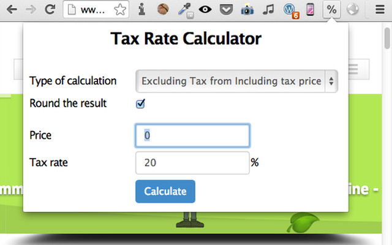
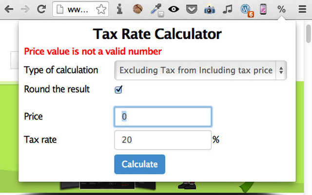
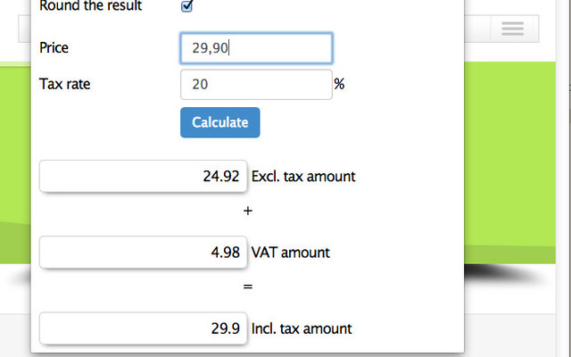

#  Tax Calculator

Tax Calculator is a Chrome Extension. It allows you to calculates the price including or excluding taxes from a tax rate :

- Choose your calculation type between excluding or including taxe
- Possibility to round the result
- fill the price
- fille the tax rate
- press the calcul button to display the result.

The result show your the excluding tax amount, including tax amount and the VAT amount.

This Extension was realised by the [Garden Media Community](http://www.garden-media.fr "Garden Media Homepage")

# Installation 

## Clone this repository

```
$git clone https://github.com/eInyzant/tax-calculator.git
```

## Install it from Chrome Store
You can find this extension on the [Chrome Store](https://chrome.google.com/webstore/detail/tax-rate-calculator/kpimejhpijkooobbiakdolkkgkhiajbk?hl=fr "Tax Calculator Extension")


# Screenshots



